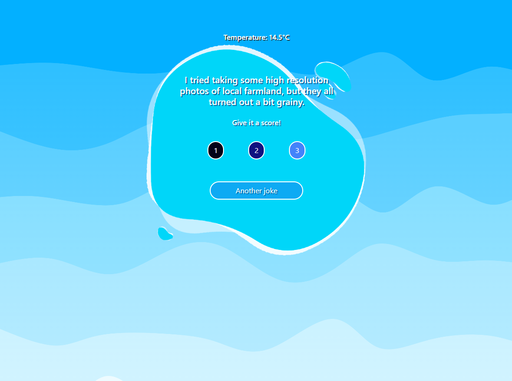

# Jokes Web Application

A web application that displays jokes and weather information to help users start their day with a smile. The application fetches jokes from multiple APIs and allows users to rate them while tracking usage statistics.



## Features

### Core Features (Level 1)
- Display random jokes from different APIs
- "Next Joke" button to fetch and display new jokes
- Basic layout and styling
- User rating system (1-3 stars)
- Tracking system that stores:
  - Joke content
  - User rating (optional)
  - Date of rating (ISO format)

### Advanced Features (Level 2)
- Weather information display
- Multiple joke sources integration
- Alternating joke sources (either sequential or random)

### Premium Features (Level 3)
- Responsive design
- Enhanced user interface
- Modern styling and animations

## Technical Implementation

### Data Structure
The application uses a `reportJokes` array to track joke interactions:
```javascript
const reportJokes = [
  {
    joke: "joke content",
    score: 1-3,  // Optional rating
    date: "ISO date string"
  }
];
```

### API Integration
The application integrates with:
- Jokes APIs (multiple sources)
- Weather API for current conditions

## Setup Instructions

1. Clone the repository
```
https://github.com/oscarrep/S4-API_TypeScript
```
2. Install dependencies
```bash
npm i
```

